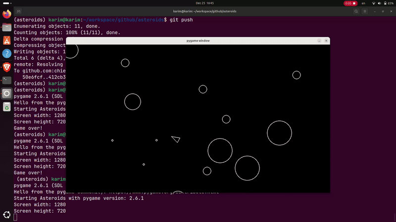

# Asteroids Game



## Overview

This is a classic Asteroids game implemented in Python. Navigate your spaceship, shoot down asteroids, and avoid collisions. The game features:

- Player spaceship with 360-degree movement and acceleration
- Asteroids of various sizes that break into smaller pieces when shot
- Game over condition

## How to Run

To run the game, ensure you have Python 3 installed. Then, follow these steps:

1.  Clone the repository:

    ```bash
    git clone https://github.com/your-username/asteroids.git
    cd asteroids
    ```

2.  Install the required dependencies:

    ```bash
    pip install -r requirements.txt
    ```

    (Note: If `requirements.txt` does not exist, you might need to install `pygame` manually: `pip install pygame`)

3.  Run the game:

    ```bash
    uv run main.py
    ```

Enjoy playing!
